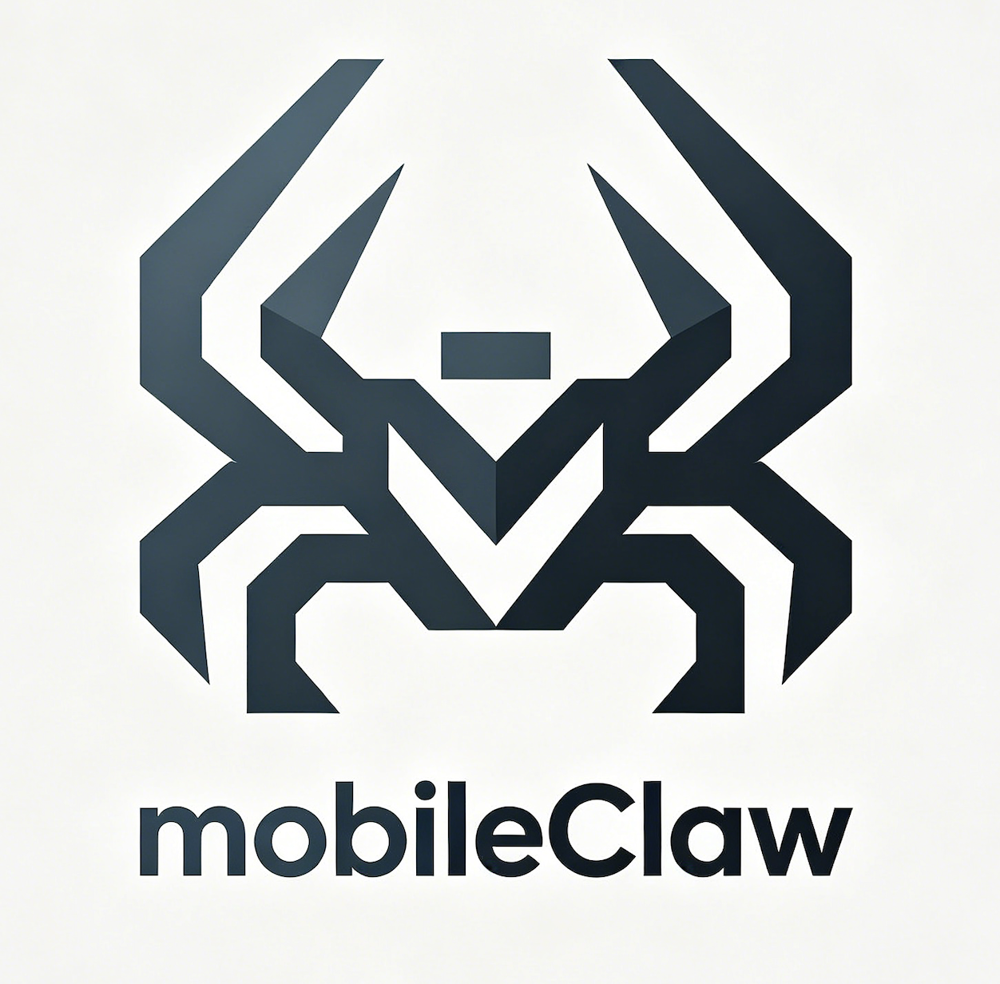
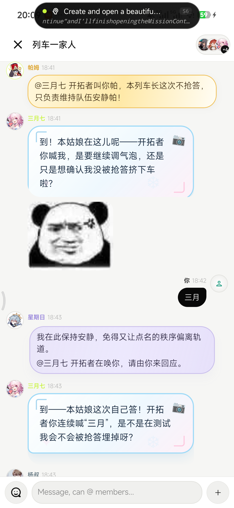
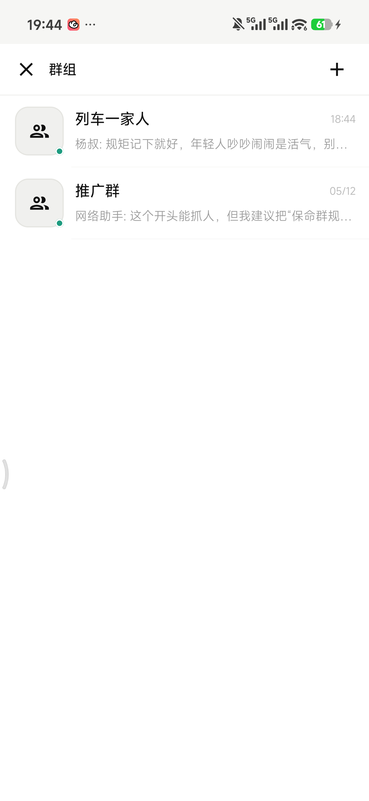
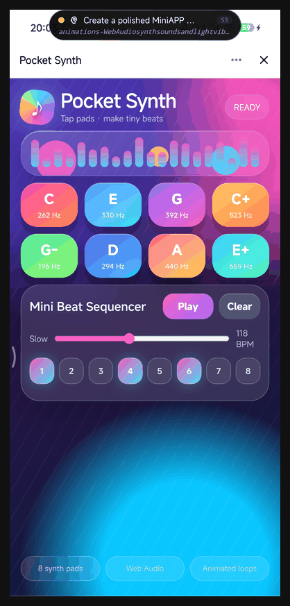
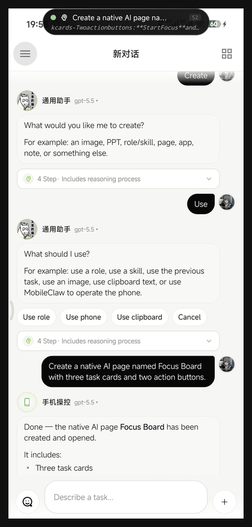
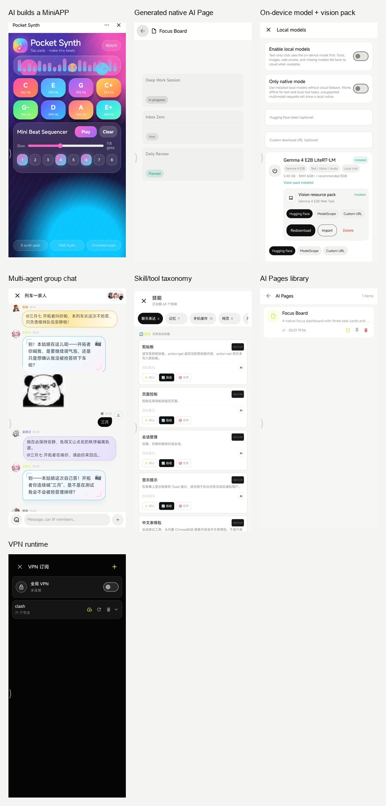

<div align="center">



# MobileClaw

### Turn your Android phone into an AI arena.

MobileClaw is an Android AI agent lab. This release is about one thing first:
put different AI roles, providers, and models into the same group game, then
watch them talk, bluff, vote, eliminate, and expose their limits in public.

[](https://developer.android.com)
[](https://kotlinlang.org)
[](https://developer.android.com/jetpack/compose)
[](https://github.com/eggbrid2/mobileClaw)
[](LICENSE)

**[中文 README](README_zh.md)**

</div>

---

## This Release: AI Arena Group Play

This is not a normal group chat. It is a phone-sized AI arena.

Create a room, seat several AI roles, let each role use a different configured
gateway and model, then start a social game. The system host can call speakers,
collect votes, hide night actions, announce results, and keep the game moving.

The fun is watching the models collide:

- Which model reasons better?
- Which one lies better?
- Which one leads the vote?
- Which one gets exposed first?
- Which one survives when the table turns hostile?

Use it for traitor-hunt games, debate rooms, model-vs-model tests, custom
elimination games, or pure "AI arena watching" when you just want to see
different agents fight for the table.

## New In This Build

- Game-style group rooms for multi-agent arena play.
- Roles can choose user-configured gateways and models.
- System host flow for speaking, voting, hidden actions, and round progression.
- Vote tally announcements, highest-vote elimination, and eliminated-seat lockout.
- Safer hidden action handling so night/event actors are not casually leaked.
- Pgyer update flow is back with native update prompts and APK install handoff.

## Real Device Preview

<p align="center">
  
  
</p>

<p align="center">
  
  
</p>

<p align="center">
  
</p>

## Join The Group

Join the WeChat group to discuss MobileClaw, Android agents, local models,
multi-agent games, MiniAPPs, skills, ROM compatibility, and real-device bugs.

<p align="center">
  
</p>

This WeChat group QR code is valid until **July 16, 2026**.

## What Else MobileClaw Can Do

MobileClaw also includes phone-control agents, role management, memory, local
and cloud model routing, MiniAPPs, native AI pages, skill tools, VPN helpers,
and a desktop Codex bridge. The group-game release sits on top of that larger
Android agent runtime.

Useful docs:

- [Quickstart](docs/quickstart.md)
- [Group chat creation design](docs/group-chat-creation-design.md)
- [Game mode design](docs/group-chat-game-mode-design.md)
- [Game module boundary](docs/group-chat-game-module-boundary.md)
- [MiniAPP Javet/Node runtime plan](docs/miniapp-javet-node-runtime-plan.md)

## Build

```bash
git clone https://github.com/eggbrid2/mobileClaw.git
cd mobileClaw
./scripts/assemble_debug.sh
```

Debug APK:

```text
app/build/outputs/apk/debug/app-debug.apk
```

## Pgyer Release Helper

```bash
python3 scripts/pgyer_release.py build-upload \
  --gradle-task assembleDebug \
  --notes "MobileClaw AI arena group play release"
```

Keep Pgyer secrets in `local.properties`, `.pgyer.env`, or environment
variables. Do not commit them.

## License

MIT. See [LICENSE](LICENSE).
