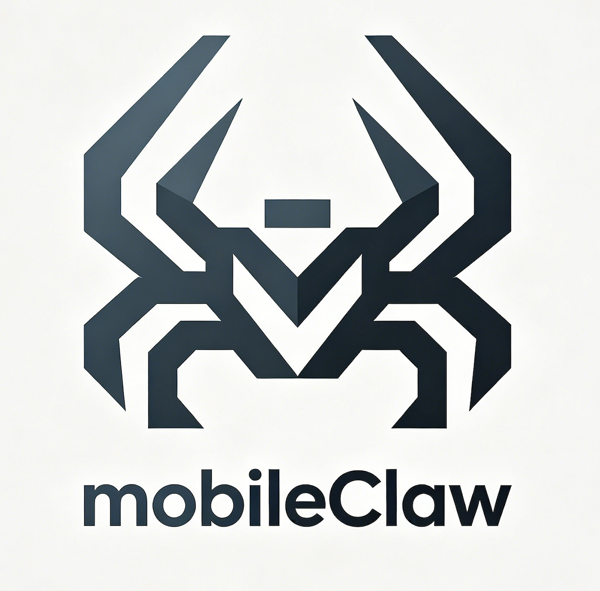

<div align="center">



# MobileClaw

### 一个开放的 Android Agent Runtime：能看屏幕、能执行、能构建、能记忆，也能自己调度工具。

MobileClaw 是一个运行在 Android 手机上的 LLM Agent 实验项目。它的目标不是再做一个聊天框，而是把手机上的可授权能力组织成一套 AI 可以调用、可以规划、可以复用的工具系统。

[](https://developer.android.com)
[](https://kotlinlang.org)
[](https://developer.android.com/jetpack/compose)
[](https://chaquo.com/chaquopy/)
[](https://platform.openai.com)
[](LICENSE)

**[English README](README.md)**

</div>

---

## 为什么做这个

大多数移动端 AI 应用只是一个聊天入口。MobileClaw 更像是一个给 Agent 用的手机操作层。

用户提出一个目标后，系统会先把它变成一次有边界的任务。任务会得到角色、短计划、受控工具集，然后进入执行循环：

```text
用户目标 -> 任务类型 -> 角色调度 -> 规划 -> 允许的 skill -> 观察 -> 行动 -> 验证
```

这个结构很关键。手机自动化如果把所有工具都塞进提示词，很快就会变成乱调用、重复读屏、上下文污染。MobileClaw 把手机控制、网页研究、文件处理、应用构建、图片生成、VPN 控制、skill 管理和代码执行拆成不同任务模式。

项目还在快速变化。有些功能已经可以日常使用，有些功能仍然是研究和工程实验状态。代码开源，是因为 Android Agent 这件事必须面对真实设备、真实 ROM、真实网络和真实用户流程。

## 当前已经实现的能力

### 手机控制

- 通过无障碍读取 Android UI XML。
- 通过 `see_screen` 做视觉读屏：截图、标记可操作目标，并返回可直接点击/滑动的坐标。
- 当 XML 为空或误导模型时，保留 `screenshot` 作为原始视觉兜底，适合 Flutter、React Native、WebView、游戏类界面。
- 支持点击、长按、滑动、输入文字、返回、Home、启动 App、列出已安装 App。
- 内置轻量 IME，为更可靠的文本输入链路预留能力。

### 后台手机任务

- 支持隐藏虚拟显示器，把 App 启动到用户主屏之外。
- 提供 `bg_launch`、`bg_read_screen`、`bg_screenshot`、`bg_stop` 等后台观察和操作工具。
- 提供 ROM 相关配置指引；如果系统拦截虚拟屏启动，可尝试 root 或一次性 ADB 激活的 shell uid 特权服务。

### 任务运行时

- `TaskClassifier` 把请求分类成 `PHONE_CONTROL`、`WEB_RESEARCH`、`APP_BUILD`、`VPN_CONTROL`、`SKILL_MANAGEMENT`、`CODE_EXECUTION` 等任务类型。
- `TaskPlanner` 在执行前做一次规划。
- `TaskToolPolicy` 按任务类型控制工具可见性。
- `RoleScheduler` 在内置角色和用户自定义角色中自动选择执行者。
- `AgentRuntime` 运行 ReAct 循环，带重复感知保护、截图上下文裁剪、结构化观察和任务事件。

### 角色和调度

内置角色包括：

- 通用助手
- 代码专家
- 网络助手
- 手机操作员
- 创作助手
- Skill 管理员
- VPN 管理员

角色不只是人设。角色可以声明适合的任务类型、关键词、调度优先级、强制注入的 skill，以及模型覆盖。用户创建的角色也会进入同一套调度器。

### Skill 系统

MobileClaw 有原生 skill 注册表和注入等级：

- Level 0：核心运行时默认可见。
- Level 1：按任务类型注入。
- Level 2：按需调用，通常是用户创建或尚未提升的 skill。

内置 skill 大致包括：

- 手机和感知：`see_screen`、`screenshot`、`read_screen`、`tap`、`scroll`、`input_text`、`navigate`、`list_apps`。
- 网络：`web_search`、`fetch_url`、隐藏 WebView 浏览、网页正文读取、网页 JS 执行。
- 文件和附件：创建/读取/列出文件，生成 HTML 页面，用户存储访问，文件卡片、图片、HTML、网页和搜索结果附件。
- 创作：图片生成、视频生成、文档生成、图标生成。
- 应用：HTML mini app 创建，原生 Compose AI Page 创建。
- 代码：内置 Python 执行、运行时安装纯 Python 包、shell 执行、控制台编辑。
- 记忆和用户数据：语义记忆、用户画像、用户配置、skill notes。
- 元工具：创建 skill、根据描述生成 skill、搜索/安装 skill 市场、管理角色、切换模型、切换角色、管理会话。
- VPN：通过 `vpn_control` 启停和查看状态。

动态 skill 支持 Python 和 HTTP 定义。通过普通 meta-skill 路径不会让 AI 生成 Native 或 Shell skill，这是有意的边界。

### Mini App 和 AI Page

MobileClaw 有两条“AI 创建应用”的路径：

- HTML mini app 运行在 WebView 中，带 `Claw` JS bridge，支持 HTTP、SQLite、Python、shell、记忆、配置、文件、剪贴板、设备信息、启动 App、打开 URL、分享文本和回调 Agent。
- AI Page 是原生 Compose 页面，以 JSON 保存。它渲染组件 DSL，并执行 HTTP、shell、通知、震动、启动 App、打开 URL、剪贴板、Intent、拨号、短信编辑、闹钟、页面跳转等 action step。

两者都能从聊天中创建。mini app 更适合快速做 Web 风格工具，AI Page 更适合做原生工作流。

### VPN 和代理运行时

MobileClaw 内置了一套面向 Android Agent 的 VPN 链路：

- 支持导入 Clash/Mihomo 订阅。
- 保存原始 YAML，不需要每次运行都重新订阅。
- 解析 HTTP、SOCKS5、Shadowsocks、YAML 中的 SSR、VMess、Trojan、VLESS 等节点。
- 节点延迟测试通过短生命周期 mihomo 进程完成。
- 运行时根据选中节点生成 `MATCH,GLOBAL` 配置。
- Android `VpnService` 创建 TUN。
- mihomo 提供本地 mixed proxy。
- `hev-socks5-tunnel` 将 Android TUN 流量桥接到 mihomo。
- 应用内 HTTP 和 WebView 可以走当前代理链路。

当前方案不使用 Xray。代理协议由 mihomo 处理；hev 仍然保留，因为 Android 全局 VPN 还需要 TUN 到 SOCKS 的桥。

### 聊天、群聊和附件

- 单聊支持文本、图片附件、文件附件、流式输出、任务日志、详情面板、长内容折叠、附件独立消息。
- 群聊支持用户和 AI 发送附件。
- 群聊有一个小型任务池。长任务只占用执行它的那个 Agent 和一个池槽，不会锁死整个群。
- 如果任务池还有容量，新的用户消息可以插队让其他 Agent 回复。

### 记忆

- Semantic memory 保存长期键值事实。
- Conversation memory 保存近期用户和 AI 对话。
- Episodic memory 记录任务结果、使用过的 skill 和反思摘要，并用本地字符 n-gram embedding 检索相似历史任务。
- User profile extractor 从对话和任务历史中抽取用户画像事实。
- Working memory 会裁剪当前任务步骤，避免上下文无限膨胀。

### 本地和局域网 API

- Loopback API 暴露 skill、动态 skill 安装/删除、memory、config，供本地 HTTP skill 调用。
- LAN console 提供浏览器控制台、SSE 任务事件、会话/消息 API、skill 导入导出、memory/config API，以及 OpenClaw CLI 脚本下载。
- Agent 可以通过 `console_editor` 读取、重写或 patch 控制台页面。

## 架构

```text
app/src/main/java/com/mobileclaw
├─ agent
│  ├─ TaskSession.kt       任务类型、任务规划、工具策略
│  ├─ AgentRuntime.kt      ReAct 循环和任务事件
│  ├─ AgentContext.kt      prompt 构造
│  ├─ Role.kt              内置角色和角色元数据
│  └─ RoleScheduler.kt     自动角色调度
├─ skill
│  ├─ SkillRegistry.kt     注册、注入等级、覆盖
│  ├─ SkillLoader.kt       动态 Python/HTTP skill 持久化
│  ├─ builtin/             内置原生 skill
│  └─ executor/            Python、HTTP、shell 执行器
├─ perception
│  ├─ ClawAccessibilityService.kt
│  ├─ ScreenshotController.kt
│  ├─ ActionController.kt
│  ├─ VirtualDisplayManager.kt
│  └─ ClawIME.kt
├─ ui
│  ├─ ChatScreen.kt        主聊天
│  ├─ GroupChatScreen.kt   多 Agent 群聊
│  ├─ DynamicUiRenderer.kt 聊天内动态 UI 渲染
│  ├─ MiniAppActivity.kt   WebView mini app
│  └─ aipage/              原生 AI Page 运行时
├─ vpn
│  ├─ VpnManager.kt
│  ├─ ClashParser.kt
│  ├─ MihomoConfigBuilder.kt
│  ├─ MihomoProcess.kt
│  └─ ClawVpnService.kt
├─ memory
│  ├─ SemanticMemory.kt
│  ├─ EpisodicMemory.kt
│  ├─ ConversationMemory.kt
│  └─ UserProfileExtractor.kt
└─ server
   ├─ ConsoleServer.kt
   ├─ LocalApiServer.kt
   ├─ PrivilegedServer.kt
   └─ PrivilegedClient.kt
```

## 构建

环境要求：

- Android Studio Ladybug 或更新版本
- JDK 17
- Android 11+ 设备或模拟器
- 一个 OpenAI 兼容 Chat 接口和 API Key

```bash
git clone https://github.com/eggbrid2/mobileClaw.git
cd mobileClaw
./gradlew :app:assembleDebug
```

Debug APK：

```text
app/build/outputs/apk/debug/app-debug.apk
```

项目使用 Kotlin、Jetpack Compose、Room、DataStore、WebView、OkHttp、Gson、Jsoup、SnakeYAML、Chaquopy Python 3.11、mihomo 和 hev-socks5-tunnel。

## 权限和设备说明

MobileClaw 的原则是把用户授权过的 Android 能力变成显式 Agent 工具。不同功能可能需要：

- 无障碍服务：读屏、截图、手势、输入。
- VPN 权限：Android `VpnService`。
- 通知权限：VPN 前台服务状态和 AI Page 通知。
- 文件和媒体访问：用户选择的附件和用户存储工具。
- 悬浮窗/后台相关权限：长任务和视觉助手能力。
- 可选 ADB 激活：部分 ROM 拦截虚拟屏启动时，用于启动 shell uid 特权服务。

Root 不是基础要求。但某些后台虚拟屏能力可能需要 ROM 设置、root 或内置 shell uid helper。

## 适合贡献的方向

- 更稳定的非标准 Android UI 自动化。
- 更好的 VLM 定位和动作校验。
- 更安全的动态 skill 审核和提升流程。
- 更好的任务策略和角色调度启发式。
- 更可复现的 VPN 订阅、mihomo 和代理边界问题修复。
- 不同 ROM 的虚拟屏兼容性报告。
- 文档、演示、小型角色和 skill 预设。

## 当前状态

MobileClaw 不是一个已经打磨完成的商业助手。它是一个有完整 App 外壳的开源 Android Agent 实验室。权限、ROM 策略、VPN 配置和长任务自动化都会有边界和坑。

如果你要贡献，建议保持行为可检查。小而清楚的工具，比一团看不见边界的“魔法”更有价值。

## License

MIT. See [LICENSE](LICENSE).
