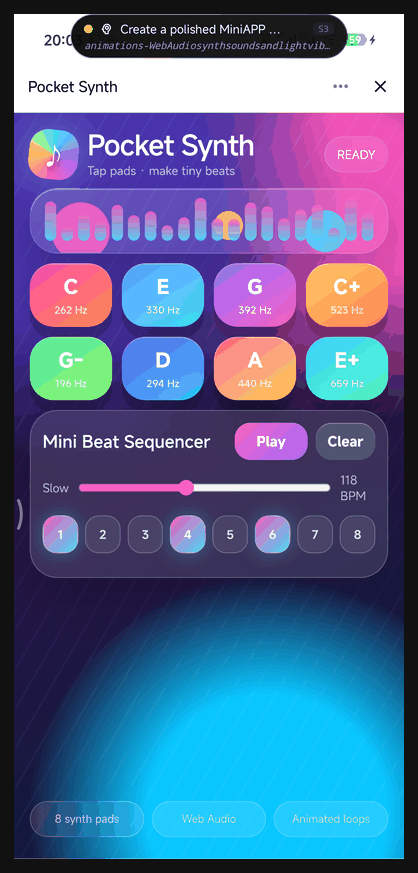
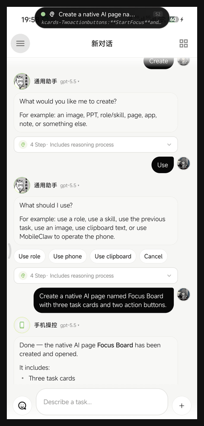
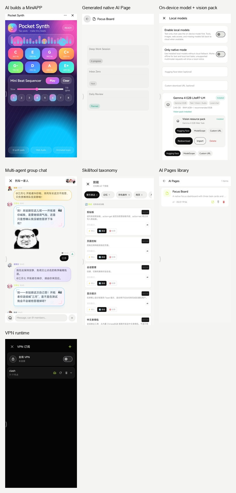

<div align="center">


# MobileClaw

### 一个开放的 Android AI Agent Runtime：能看屏幕、能控制 App、能构建工具、能记忆上下文，也能自己调度 Skill。

MobileClaw 是一个运行在 Android 手机上的 LLM Agent 实验项目。它覆盖 Android 自动化、移动端 AI Agent、无障碍手机控制、端侧 Python 工具、多 Agent 工作流，以及 VPN/代理操作。

它的目标不是再做一个聊天框，而是把手机上的可授权能力组织成一套 AI 可以调用、可以规划、可以复用的工具系统。

[](https://developer.android.com)
[](https://kotlinlang.org)
[](https://developer.android.com/jetpack/compose)
[](https://chaquo.com/chaquopy/)
[](https://platform.openai.com)
[](LICENSE)

**[English README](README.md)**

</div>

---

## 项目状态

MobileClaw 目前正在翻新 UI，所以部分页面在过渡期内可能会有界面不统一、略显凌乱的感觉。

MobileClaw 已包含 MCP 客户端能力，可以通过内置 `mcp_client` skill 连接标准 Streamable HTTP 或 SSE MCP Server，执行 `initialize`、`tools/list` 和 `tools/call`。技能市场里也有 `ModelScope MCP` 入口：粘贴 ModelScope MCP 广场生成的 SSE 地址或配置 JSON，再填 Token，即可发现工具并安装成普通 MobileClaw 技能。

## 真机能力演示

以下素材来自小米真机运行的 debug build。它们不是静态展示页，而是真实 Agent 执行链路：MobileClaw 创建并打开了 WebView MiniAPP，创建了原生 AI Page，展示了多 Agent 群聊和表情包，也展示了本地模型与视觉资源包管理，以及 skill、VPN 等真实运行界面。

<p align="center">
  
  
</p>

<p align="center">
  
</p>

## 交流群

欢迎加入微信群，讨论 MobileClaw 使用、Android Agent 开发、本地模型、Skill、ROM 兼容、真机问题和有意思的玩法。

<p align="center">
  
</p>

该微信群二维码有效期至 **2026 年 7 月 3 日**。如果过期，请查看最新 README 或联系维护者获取新的入群二维码。

## 为什么做这个

大多数移动端 AI 应用只是一个聊天入口。MobileClaw 更像是一个给 Agent 用的手机操作层。

用户提出一个目标后，系统会先把它变成一次有边界的任务。任务会得到角色、短计划、受控工具集，然后进入执行循环：

```text
用户目标 -> 任务类型 -> 角色调度 -> 规划 -> 允许的 skill -> 观察 -> 行动 -> 验证
```

这个结构很关键。手机自动化如果把所有工具都塞进提示词，很快就会变成乱调用、重复读屏、上下文污染。MobileClaw 把手机控制、网页研究、文件处理、应用构建、图片生成、VPN 控制、skill 管理和代码执行拆成不同任务模式。

项目还在快速变化。有些功能已经可以日常使用，有些功能仍然是研究和工程实验状态。代码开源，是因为 Android Agent 这件事必须面对真实设备、真实 ROM、真实网络和真实用户流程。

## 当前已经实现的能力

### 常见使用场景

- 用于手机控制和 App 自动化的 Android AI Agent。
- 类 VLM 的屏幕理解：读取截图、定位控件、按坐标点击和滑动。
- 通过 AccessibilityService 操作真实 Android App 的 AI 助手。
- 带任务规划、角色路由、工具白名单的移动端 Agent Runtime。
- 支持长任务和插队机制的多 Agent 群聊。
- AI 生成 HTML mini app 和原生 Android 页面。
- 可选端侧本地模型运行时，支持下载和管理 Gemma LiteRT 模型。
- 导入 Clash/Mihomo 订阅并控制 Android VPN。
- 在 Android 内执行 Python，并动态创建可复用 Skill。

### 手机控制

- 通过无障碍读取 Android UI XML。
- 通过 `see_screen` 做视觉读屏：截图、标记可操作目标，并返回可直接点击/滑动的坐标。
- 当 XML 为空或误导模型时，保留 `screenshot` 作为原始视觉兜底，适合 Flutter、React Native、WebView、游戏类界面。
- 支持点击、长按、滑动、输入文字、返回、Home、启动 App、列出已安装 App。
- 内置轻量 IME，为更可靠的文本输入链路预留能力。

### 后台手机任务

- 支持隐藏虚拟显示器，把 App 启动到用户主屏之外。
- 提供 `bg_launch`、`bg_read_screen`、`bg_screenshot`、`bg_stop` 等后台观察和操作工具。
- 提供 ROM 相关配置指引；如果系统拦截虚拟屏启动，可尝试 root 或一次性 ADB 激活的 shell uid 特权服务。

### 任务运行时

- `TaskClassifier` 把请求分类成 `PHONE_CONTROL`、`WEB_RESEARCH`、`APP_BUILD`、`VPN_CONTROL`、`SKILL_MANAGEMENT`、`CODE_EXECUTION` 等任务类型。
- `TaskPlanner` 在执行前做一次规划。
- `TaskToolPolicy` 按任务类型控制工具可见性。
- `RoleScheduler` 在内置角色和用户自定义角色中自动选择执行者。
- `AgentRuntime` 运行 ReAct 循环，带重复感知保护、截图上下文裁剪、结构化观察和任务事件。

### 角色和调度

内置角色包括：

- 通用助手
- 代码专家
- 网络助手
- 手机操作员
- 创作助手
- Skill 管理员
- VPN 管理员

角色不只是人设。角色可以声明适合的任务类型、关键词、调度优先级、强制注入的 skill，以及模型覆盖。用户创建的角色也会进入同一套调度器。

角色 UI 现在更偏向“快速选择谁来干活”，而不是复杂的人设装饰页。角色页会先突出当前角色，再用可读的能力标签展示内置和自定义角色，例如写代码、查资料、控手机、建应用、做图片、VPN 和管技能。内置角色作为预设被保护：编辑内置角色会创建一个自定义副本；自定义角色才会直接编辑。系统提示词、模型覆盖、固定 skill 等高门槛配置被收进高级设置，普通创建流程只保留基础信息和擅长任务。

### Skill 系统

MobileClaw 有原生 skill 注册表和注入等级：

- Level 0：核心运行时默认可见。
- Level 1：按任务类型注入。
- Level 2：按需调用，通常是用户创建或尚未提升的 skill。

内置 skill 大致包括：

- 手机和感知：`see_screen`、`screenshot`、`read_screen`、`tap`、`scroll`、`input_text`、`navigate`、`list_apps`。
- 网络：`web_search`、`fetch_url`、隐藏 WebView 浏览、网页正文读取、网页 JS 执行。
- 文件和附件：创建/读取/列出文件，生成 HTML 页面，用户存储访问，文件卡片、图片、HTML、网页和搜索结果附件。
- 创作：图片生成、视频生成、文档生成、图标生成。
- 应用：HTML mini app 创建，原生 Compose AI Page 创建。
- 代码：内置 Python 执行、运行时安装纯 Python 包、shell 执行、控制台编辑。
- 记忆和用户数据：语义记忆、用户画像、用户配置、skill notes。
- 元工具：创建 skill、根据描述生成 skill、搜索/安装 skill 市场、管理角色、切换模型、切换角色、管理会话。
- VPN：通过 `vpn_control` 启停和查看状态。

动态 skill 支持 Python 和 HTTP 定义。通过普通 meta-skill 路径不会让 AI 生成 Native 或 Shell skill，这是有意的边界。

### Mini App 和 AI Page

MobileClaw 有两条“AI 创建应用”的路径：

- HTML mini app 运行在 WebView 中，带 `Claw` JS bridge，支持 HTTP、SQLite、Python、shell、记忆、配置、文件、剪贴板、设备信息、启动 App、打开 URL、分享文本和回调 Agent。
- AI Page 是原生 Compose 页面，以 JSON 保存。它渲染组件 DSL，并执行 HTTP、shell、通知、震动、启动 App、打开 URL、剪贴板、Intent、拨号、短信编辑、闹钟、页面跳转等 action step。

两者都能从聊天中创建。mini app 更适合快速做 Web 风格工具，AI Page 更适合做原生工作流。

### VPN 和代理运行时

MobileClaw 内置了一套面向 Android Agent 的 VPN 链路：

- 支持导入 Clash/Mihomo 订阅。
- 保存原始 YAML，不需要每次运行都重新订阅。
- 解析 HTTP、SOCKS5、Shadowsocks、YAML 中的 SSR、VMess、Trojan、VLESS 等节点。
- 节点延迟测试通过短生命周期 mihomo 进程完成。
- 运行时根据选中节点生成 `MATCH,GLOBAL` 配置。
- Android `VpnService` 创建 TUN。
- mihomo 提供本地 mixed proxy。
- `hev-socks5-tunnel` 将 Android TUN 流量桥接到 mihomo。
- 应用内 HTTP 和 WebView 可以走当前代理链路。

当前方案不使用 Xray。代理协议由 mihomo 处理；hev 仍然保留，因为 Android 全局 VPN 还需要 TUN 到 SOCKS 的桥。

### 聊天、群聊和附件

- 单聊支持文本、图片附件、文件附件、流式输出、任务日志、详情面板、长内容折叠、附件独立消息。
- 群聊支持用户和 AI 发送附件。
- 群聊有一个小型任务池。长任务只占用执行它的那个 Agent 和一个池槽，不会锁死整个群。
- 如果任务池还有容量，新的用户消息可以插队让其他 Agent 回复。
- 群聊角色可以拥有自己的气泡风格。系统鼓励 Agent 默认使用原生 Markdown 气泡，然后按角色个性调整预设、文字颜色、字体、字重、字号、渐变、背景图、纹理、情绪字段、四角圆角、内边距、阴影、小装饰和轻量文字/边框动画。
- 当原生 Markdown 气泡不够表达复杂结构或特殊动效时，角色可以切换到 HTML 气泡。HTML 气泡支持自定义模板、高度、透明背景、可选 JavaScript 和可选网络图片，但默认仍优先使用原生渲染，以保持性能和 App 一致性。
- 内置 ChineseBQB 表情包支持搜索和收藏，使用缩略图网格展示；点击表情会直接作为表情/图片消息发送，不会被包装成普通附件卡片。

### 记忆

- Semantic memory 保存长期键值事实。
- Conversation memory 保存近期用户和 AI 对话。
- Episodic memory 记录任务结果、使用过的 skill 和反思摘要，并用本地字符 n-gram embedding 检索相似历史任务。
- User profile extractor 从对话和任务历史中抽取用户画像事实。
- Working memory 会裁剪当前任务步骤，避免上下文无限膨胀。

### 本地模型

MobileClaw 可以通过 LiteRT-LM 运行部分端侧模型：

- 设置页提供本地模型入口，支持下载、导入、删除、启用和选择当前本地模型。
- 内置下载项包含 Gemma 4 E2B 和 Gemma 4 E4B LiteRT-LM 包。
- 多模态 `.task` 资源包可以单独下载或导入；当前 Android LiteRT-LM 聊天路径使用 `.litertlm` 文本运行时文件。
- 模型下载支持多个来源：Hugging Face、ModelScope，以及用户粘贴的自定义直链。
- Hugging Face Token 只会用于官方 Hugging Face 下载，不会发送给国内镜像或自定义 URL。
- 启用后，纯文本聊天优先走本地模型；默认情况下工具调用、图片输入、联网访问或本地模型不可用时，会在可能的情况下自动回退到已配置的云端接口。设置中可额外开启“实验性本地 Agent 工具”，让本地文本模型先尝试 JSON 工具调用，再按需回退云端。

### 本地和局域网 API

- Loopback API 暴露 skill、动态 skill 安装/删除、memory、config，供本地 HTTP skill 调用。
- LAN console 提供浏览器控制台、SSE 任务事件、会话/消息 API、skill 导入导出、memory/config API，以及 OpenClaw CLI 脚本下载。
- Agent 可以通过 `console_editor` 读取、重写或 patch 控制台页面。

## Codex 手机桥、蒲公英发布和版本规则

这一组能力用于“手机上的 MobileClaw 控制电脑上的 Codex”，以及把新版本发布到蒲公英后让 MobileClaw 检查和下载更新。

### 手机连接电脑 Codex

电脑端需要先安装并登录 Codex CLI：

```bash
npm install -g @openai/codex
codex --login
```

然后在电脑上启动 MobileClaw Codex bridge：

```bash
CODEX_BRIDGE_TOKEN="换成自己的长随机 token" \
CODEX_BRIDGE_HOST=0.0.0.0 \
CODEX_BRIDGE_PORT=52734 \
python3 scripts/codex_desktop_bridge.py
```

如果通过 Tailscale 或同一局域网访问，在 MobileClaw 的用户配置中写入：

```text
codex_desktop_endpoint = http://电脑的局域网或 Tailscale IP:52734
codex_desktop_token = 上面设置的 CODEX_BRIDGE_TOKEN
codex_desktop_cwd = /电脑上的/mobileClaw/项目路径
```

打开聊天页顶部的 Codex 开关后，同一个 MobileClaw 会话会绑定同一个 Codex thread。第一轮会创建 Codex 会话，后续消息会通过 `codex exec resume <thread_id>` 继续同一上下文，不会每次新开会话。

当前 Codex mode 的展示方式：

- 用户输入会原样发送给桌面 Codex。
- Codex 的命令执行进度会实时返回到手机 timeline。
- 命令完成后会展示命令结果摘要。
- 最终正文按块渐进显示，避免一次性刷出大段文本。
- 如果 Codex CLI 的 JSON 输出只提供 `agent_message item.completed`，最终正文不是模型 token 级流式；MobileClaw 会在 UI 层做渐进渲染。

### 蒲公英发布、更新检查和下载

MobileClaw 内置 `pgyer_release` skill，支持：

- `status`：检查蒲公英配置是否存在。
- `check_update` / `update`：调用蒲公英检查更新接口。
- `download`：调用 Android `DownloadManager` 下载最新 APK 到系统 Downloads。
- `upload`：上传一个手机本地 APK 路径到蒲公英。

需要在 MobileClaw 用户配置中写入：

```text
pgyer_api_key = 蒲公英 API Key
pgyer_app_key = 蒲公英 App Key
pgyer_install_password = 安装密码，可选
```

聊天里可以直接说：

```text
检查蒲公英更新
下载蒲公英最新版本
查看蒲公英发布配置
```

Agent 会调用 `pgyer_release` 完成对应动作。

电脑端也提供发布脚本，适合 Codex 在桌面构建和上传：

```bash
PGYER_API_KEY="蒲公英 API Key" \
python3 scripts/pgyer_release.py build-upload
```

如果 APK 已经构建好，可以只上传：

```bash
PGYER_API_KEY="蒲公英 API Key" \
python3 scripts/pgyer_release.py upload --apk app/build/outputs/apk/debug/app-debug.apk
```

也可以检查蒲公英当前版本：

```bash
PGYER_API_KEY="蒲公英 API Key" \
PGYER_APP_KEY="蒲公英 App Key" \
python3 scripts/pgyer_release.py check
```

脚本默认发布说明会使用当前 Git 信息，例如：

```text
MobileClaw v0.3.7-dirty (main/47226c4)
```

### 版本和 Git 保持统一

Android 版本不再手写固定值，而是从 Git 生成：

```text
versionName = git describe --tags --always --dirty
versionCode = git rev-list --count HEAD
```

同时会写入：

```text
BuildConfig.GIT_VERSION
BuildConfig.GIT_COMMIT
BuildConfig.GIT_BRANCH
```

这样蒲公英更新检查、App 内状态、发布脚本和 Git 版本能保持同一个来源。工作区有未提交改动时，`versionName` 会带 `-dirty`，例如 `v0.3.7-dirty`。

### 构建注意事项

日常代码验证可以先跑：

```bash
./gradlew compileDebugKotlin -x kaptDebugKotlin
```

完整打包需要当前项目的 kapt/JDK 链路能处理 `litertlm-android` 依赖。如果 `assembleDebug` 在 `kaptDebugKotlin` 报 class file 版本不匹配，需要先修复本机 Gradle/kapt 的 JDK 配置，再执行蒲公英 `build-upload`。

## 架构

```text
app/src/main/java/com/mobileclaw
├─ agent
│  ├─ TaskSession.kt       任务类型、任务规划、工具策略
│  ├─ AgentRuntime.kt      ReAct 循环和任务事件
│  ├─ AgentContext.kt      prompt 构造
│  ├─ Role.kt              内置角色和角色元数据
│  └─ RoleScheduler.kt     自动角色调度
├─ skill
│  ├─ SkillRegistry.kt     注册、注入等级、覆盖
│  ├─ SkillLoader.kt       动态 Python/HTTP skill 持久化
│  ├─ builtin/             内置原生 skill
│  └─ executor/            Python、HTTP、shell 执行器
├─ perception
│  ├─ ClawAccessibilityService.kt
│  ├─ ScreenshotController.kt
│  ├─ ActionController.kt
│  ├─ VirtualDisplayManager.kt
│  └─ ClawIME.kt
├─ ui
│  ├─ ChatScreen.kt        主聊天
│  ├─ GroupChatScreen.kt   多 Agent 群聊
│  ├─ DynamicUiRenderer.kt 聊天内动态 UI 渲染
│  ├─ MiniAppActivity.kt   WebView mini app
│  └─ aipage/              原生 AI Page 运行时
├─ vpn
│  ├─ VpnManager.kt
│  ├─ ClashParser.kt
│  ├─ MihomoConfigBuilder.kt
│  ├─ MihomoProcess.kt
│  └─ ClawVpnService.kt
├─ llm
│  ├─ OpenAiGateway.kt     OpenAI 兼容云端网关
│  ├─ LocalGemmaGateway.kt LiteRT-LM 本地模型网关
│  └─ LocalModelManager.kt 本地模型下载、导入和删除
├─ memory
│  ├─ SemanticMemory.kt
│  ├─ EpisodicMemory.kt
│  ├─ ConversationMemory.kt
│  └─ UserProfileExtractor.kt
└─ server
   ├─ ConsoleServer.kt
   ├─ LocalApiServer.kt
   ├─ PrivilegedServer.kt
   └─ PrivilegedClient.kt
```

## 构建

环境要求：

- Android Studio Ladybug 或更新版本
- JDK 21
- Android 11+ 设备或模拟器
- 一个 OpenAI 兼容 Chat 接口和 API Key

```bash
git clone https://github.com/eggbrid2/mobileClaw.git
cd mobileClaw
./scripts/assemble_debug.sh
```

Debug APK：

```text
app/build/outputs/apk/debug/app-debug.apk
```

构建脚本会优先使用 Android Studio 自带的 JBR 21，并为 Chaquopy/pip 设置
`NO_PROXY=*`，避免本机或 Android Studio 里遗留的代理变量导致 Python 依赖下载失败。
如果直接在 Android Studio 里构建，请把 Gradle JDK 设置为 JBR 21；当 IDE 或 shell
导出了代理变量时，也需要给 Gradle 环境补上 `NO_PROXY=*`。

项目使用 Kotlin 2.2、Jetpack Compose、Room、DataStore、WebView、OkHttp、Gson、Jsoup、SnakeYAML、Chaquopy Python 3.11、LiteRT-LM、mihomo 和 hev-socks5-tunnel。

## 项目文档

- [快速开始](docs/quickstart.md)
- [贡献指南](CONTRIBUTING.md)
- [路线图](ROADMAP.md)
- [隐私说明](PRIVACY.md)
- [安全策略](SECURITY.md)
- Recipes:
  - [手机控制冒烟测试](docs/recipes/phone-control.md)
  - [小型 Skill 贡献](docs/recipes/skill-authoring.md)
  - [ROM 兼容性报告](docs/recipes/rom-compatibility-report.md)

## 权限和设备说明

MobileClaw 的原则是把用户授权过的 Android 能力变成显式 Agent 工具。不同功能可能需要：

- 无障碍服务：读屏、截图、手势、输入。
- VPN 权限：Android `VpnService`。
- 通知权限：VPN 前台服务状态和 AI Page 通知。
- 文件和媒体访问：用户选择的附件和用户存储工具。
- 悬浮窗/后台相关权限：长任务和视觉助手能力。
- 可选 ADB 激活：部分 ROM 拦截虚拟屏启动时，用于启动 shell uid 特权服务。

Root 不是基础要求。但某些后台虚拟屏能力可能需要 ROM 设置、root 或内置 shell uid helper。

## 适合贡献的方向

- 更稳定的非标准 Android UI 自动化。
- 更好的 VLM 定位和动作校验。
- 更安全的动态 skill 审核和提升流程。
- 更好的任务策略和角色调度启发式。
- 更可复现的 VPN 订阅、mihomo 和代理边界问题修复。
- 不同 ROM 的虚拟屏兼容性报告。
- 文档、演示、小型角色和 skill 预设。

提交 PR 前建议先看 [CONTRIBUTING.md](CONTRIBUTING.md)。如果是设备或 ROM 行为问题，请使用 ROM 兼容性 Issue 模板，并按 [docs/recipes/rom-compatibility-report.md](docs/recipes/rom-compatibility-report.md) 填写信息。

## 当前状态

MobileClaw 不是一个已经打磨完成的商业助手。它是一个有完整 App 外壳的开源 Android Agent 实验室。权限、ROM 策略、VPN 配置和长任务自动化都会有边界和坑。

如果你要贡献，建议保持行为可检查。小而清楚的工具，比一团看不见边界的“魔法”更有价值。

## License

MIT. See [LICENSE](LICENSE).
