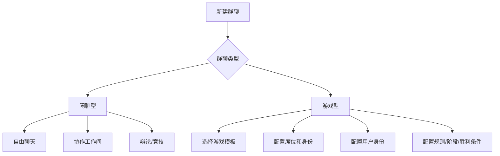
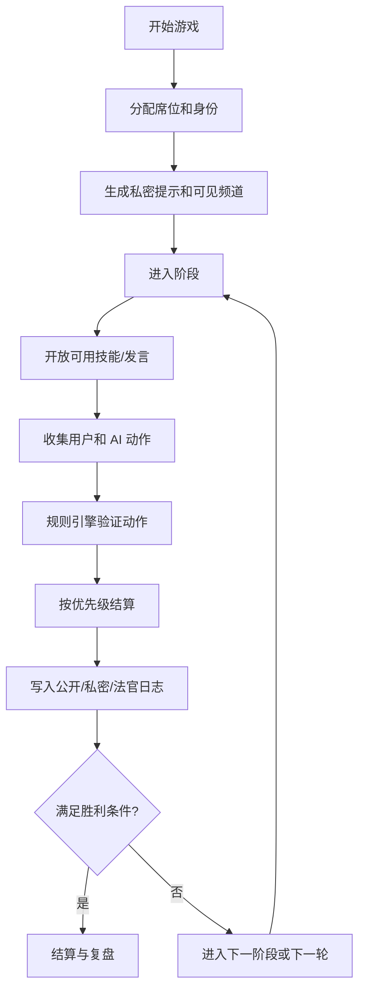

# Group Chat Game Mode Design

群聊需要先分成两种大类：闲聊型和游戏型。

闲聊型是角色之间自然聊天、协作、辩论、模型竞技。它没有隐藏身份和严格规则引擎，重点是发言节奏、角色模型差异和任务协作。

游戏型是带规则、身份、阵营、回合、私密信息和可执行动作的多智能体玩法。狼人杀只是其中一种模板，底层不能写死成狼人杀。

## Core Split



## Concepts

### AI Role

AI Role 是现在已有的角色：人格、头像、描述、系统提示、网关、模型、工具偏好。

它回答“这个演员是谁、用哪个模型、怎么说话、擅长什么”。

### Game Identity

Game Identity 是游戏里的身份牌：狼人、预言家、猎人、平民、法官、侦探、刺客、守卫等。

它回答“这个席位在这局游戏里属于哪个阵营、知道什么、能做什么、怎么赢”。

### Game Seat

Game Seat 把 AI Role 或用户绑定到 Game Identity。

同一个 AI Role 可以在不同游戏里拿不同身份。游戏身份只影响这一局，不改角色本体。

## Data Model Draft

```kotlin
enum class GroupKind {
    CHAT,
    GAME,
}

data class GameProfile(
    val templateId: String,
    val templateName: String,
    val seats: List<GameSeat>,
    val phases: List<GamePhase>,
    val currentPhaseId: String,
    val channels: List<GameChannel>,
    val publicRules: String,
    val hiddenStateJson: String,
    val winConditionJson: String,
    val autoHost: Boolean,
)

data class GameRuntimeState(
    val roundIndex: Int,
    val phaseStartedAt: Long,
    val actions: List<GameActionRecord>,
    val scores: Map<String, Int>,
    val flags: Map<String, String>,
)

data class GameSeat(
    val seatId: String,
    val actorType: GameActorType, // USER or AI_ROLE
    val actorId: String,          // "user" or roleId
    val displayName: String,
    val identityId: String,
    val teamId: String,
    val status: GameSeatStatus,
    val abilityIds: List<String>,
    val knowledgeScope: GameKnowledgeScope,
)

data class GameIdentity(
    val id: String,
    val name: String,
    val teamId: String,
    val publicHint: String,
    val privatePrompt: String,
    val abilityIds: List<String>,
    val winConditionTags: List<String>,
)

data class GameAbility(
    val id: String,
    val name: String,
    val trigger: AbilityTrigger,
    val targetRule: TargetRule,
    val usageLimit: Int,
    val visibility: AbilityVisibility,
    val resolution: AbilityResolution,
)
```

## Ability System

游戏技能不要直接等同于 MobileClaw 的系统工具。游戏技能应该先进入 Game Runtime，由规则引擎验证是否合法，再更新游戏状态。

能力用通用原语表达，而不是每个游戏写一套硬逻辑。

- `ELIMINATE`: 出局，比如狼刀、猎人枪杀、刺客击杀。
- `PROTECT`: 保护，比如守卫、护盾、免疫。
- `INSPECT`: 查验，比如预言家查阵营、侦探查身份。
- `BLOCK`: 禁用行动，比如沉默、封锁技能。
- `REVIVE`: 复活或救人。
- `VOTE`: 投票、放逐、队内决策。
- `MESSAGE_PRIVATE`: 私聊或团队会议。
- `SET_FLAG`: 标记状态，比如中毒、已查验、已保护。
- `REVEAL`: 公开身份、公开阵营、公开证据。

AI 不应该只靠自然语言说“我要刀某某”。它应该调用结构化动作：

```json
{
  "type": "GAME_ACTION",
  "abilityId": "wolf_kill",
  "targetSeatIds": ["seat_4"],
  "reason": "对方白天发言暴露了预言家视角"
}
```

本地模型工具调用不稳定时，也可以让 Game Runtime 支持隐藏协议解析，但原始 JSON 不应该直接展示给用户。

## Werewolf-Like Mapping

狼人杀可以由通用能力组合出来。

| 玩法元素 | 通用设计 |
| --- | --- |
| 狼人刀 | Team ability，夜晚狼人频道开启，队内会议后锁定一个 `ELIMINATE` 目标 |
| 狼人小会议 | Private channel，只有狼队和全局视野法官可见 |
| 预言家查验 | `INSPECT`，返回阵营或身份，结果只给预言家 |
| 女巫救人 | `PROTECT` 或 `REVIVE`，消耗一次药剂，是否知道被刀目标由模板配置 |
| 女巫毒人 | `ELIMINATE`，消耗一次药剂 |
| 猎人开枪 | `ON_DEATH` 触发的 `ELIMINATE`，若死因允许则弹出一次行动 |
| 守卫守护 | `PROTECT`，目标选择可限制不能连续同守 |
| 白天投票 | `VOTE`，公开频道讨论后结算 |
| 法官 | Host actor，拥有全局视野、阶段推进、纠错和手动裁决能力 |

## User Role

用户在游戏型群聊里有四种身份选择。

- 法官：全局视野，能看所有身份、私聊频道、行动队列和结算。主要负责控场，也可以让 AI 自动主持。
- 旁观者：默认只看公开信息；可选择全局旁观，但需要明显标记，避免破坏代入。
- 玩家：占一个席位，和 AI 一样被分配身份、阵营、技能和可见信息。
- 共同主持：用户能看全局，但 AI 法官负责自动推进，用户只在争议时介入。

## Channels

游戏型不能只有一个群消息流，需要多种频道。

- Public channel：所有存活玩家和旁观者可见。
- Team channel：阵营会议，比如狼人夜聊。
- Private channel：单个玩家的技能结果，比如预言家查验结果。
- Dead channel：死亡玩家讨论区，可按模板开启或关闭。
- Judge channel：法官日志，记录隐藏行动、冲突和结算。

每条消息必须带 `channelId` 和 `visibility`。角色 prompt 只注入它有权限看到的频道内容。

## Runtime Loop



## Rule Book

保护、击杀、投票不能写死在某个模板里。每个游戏模板只是一组预设，用户在创建游戏时可以通过“规则配置器”修改规则书。最终保存到 `winConditionJson`，运行时先读结构化配置，再从 `publicRules` 做关键词兜底推断。

当前支持的规则原语：

- `protect.blocksEliminate`: 保护是否挡击杀/得分。
- `protect.preventConsecutiveSameTarget`: 是否禁止同一行动者连续守同一目标。
- `eliminate.effect`: `out`、`score`、`out_and_score`、`record_only`。
- `eliminate.actorPoints` / `targetPoints`: 击杀结算时给行动者或目标的分数。
- `vote.effect`: `plurality_out`、`majority_out`、`score_target`、`score_actor`、`record_only`。
- `vote.tiePolicy`: `no_effect`、`all`、`first`。
- `scoreLimit`: 终局积分参考线，只作为最终裁定证据，不触发中途胜利。
- `finalJudgement.criteria`: 用户配置的终局胜负判定标准。最终轮结束后由 AI/法官按此标准裁定胜负。

创建页上的规则配置器应该暴露成人能理解的控件：

- 行动效果：出局、计分、出局+计分、仅记录。
- 保护规则：是否挡行动效果、是否禁止连续守同一目标。
- 投票效果：最高票出局、多数出局、目标计分、投票者计分、仅记录。
- 平票处理：平票无效、平票全生效、取先到。
- 分数：行动者得分、目标得分、投票者得分、目标每票得分、终局积分参考。
- 终局判定标准：最终轮结束后 AI 应如何区分胜负。

“积分击杀游戏”只是一个预设示例，不是底层逻辑：

```json
{
  "scoreLimit": 5,
  "scoring": {
    "enabled": true,
    "killPoints": 1,
    "voteActorPoints": 1
  },
  "eliminate": {
    "effect": "score",
    "actorPoints": 1,
    "targetPoints": 0
  },
  "protect": {
    "blocksEliminate": true,
    "preventConsecutiveSameTarget": false
  },
  "vote": {
    "effect": "score_actor",
    "actorPoints": 1,
    "tiePolicy": "no_effect"
  },
  "finalJudgement": {
    "mode": "ai_after_final_round",
    "timing": "after_round_limit",
    "criteria": "最终轮结束后，AI 优先比较积分，其次看有效击杀、有效保护、投票质量和公开理由。达到 5 分只是强证据，不在中途自动胜利。"
  }
}
```

这类游戏里，击杀不让目标出局，只在未被保护时给行动者加分；投票也可以只计分。这样用户可以继续扩展成悬赏击杀、积分护盾、阵营积分、淘汰加分等玩法。

自定义游戏模板必须提供可操作的通用能力，而不是只有一段规则文本。最低能力组合：

- `custom_action`: 普通记录行动。
- `custom_hit`: 使用 `ELIMINATE` 原语，按规则配置产生出局、计分、出局+计分或仅记录。
- `custom_protect`: 使用 `PROTECT` 原语，按规则配置挡行动效果。
- `custom_vote`: 使用 `VOTE` 原语，按规则配置放逐、计分或仅记录。

这样用户可以用同一套能力配置出很多玩法，例如积分击杀、赏金追猎、公开淘汰赛、护盾抢分、全员投票计分、无出局复盘局。

## Creation UI

移动端创建流程要保持短，复杂项折叠。

1. 类型：闲聊型 / 游戏型。
2. 模板：狼人杀类、积分击杀、推理对局、自定义规则。
3. 席位：选择 AI 角色和用户是否加入。
4. 身份分配：随机、手动、半随机。
5. 用户身份：法官、旁观者、玩家、共同主持。
6. 规则：轮数、是否自动主持、是否允许私聊、身份是否公开、死亡后能否发言。
7. 预览：展示席位、公开规则、用户视角。
8. 开局。

UI 仍然使用会话页风格：暖白背景、白色分组、暖灰分割线、黑色主按钮、短 pill，不做彩色游戏皮肤。

## Chat Screen UI

游戏运行时顶部显示阶段状态。

- `第 2 夜 · 狼人会议 · 等待 2 个动作`
- `第 1 天 · 公开讨论 · 等待发言`
- `投票中 · 4/7 已投`

当前不做倒计时。阶段推进和阶段结算由用户/法官手动触发，后续自动主持也应基于动作收集和规则状态，不基于时间倒数。

底部输入区根据当前状态变化。

- 普通发言：输入框。
- 可行动：输入框上方出现能力 pill，比如 `刀人`、`查验`、`守护`、`投票`。
- 私密频道：频道 pill，例如 `公开`、`狼人会议`、`法官日志`。
- 法官视角：增加 `推进阶段`、`重算`、`公开摘要`、`结束游戏`。

## Implementation Plan

1. 增加 `GroupKind`，把现有 `GroupMode` 归入闲聊型或结构化聊天，新增 `GameProfile`。
2. 增加 Game Template 模型，先内置一个狼人杀类模板和一个通用推理对局模板。
3. 增加 Game Runtime：席位、身份、阶段、频道、动作队列、结算、胜利判断。
4. 增加 AI 可调用的 `game_runtime` 工具，所有游戏动作走结构化动作，不直接靠聊天文本解析。
5. 重做游戏型创建 UI：类型、模板、席位、身份、用户角色、规则、预览。
6. 改造群聊页：阶段状态条、频道切换、能力操作条、法官面板。
7. 增加复盘：每局记录关键行动、胜负条件、角色表现、模型表现。

## Key Rule

游戏型群聊的本质不是“让 AI 模仿玩游戏”，而是“规则引擎主持，AI 在自己的可见信息内决策和表达”。这样才能支持狼人杀、阵营博弈、推理对局、逻辑比拼和后续自定义玩法。

## Current Implementation Slice

已落地第一阶段：群聊创建页可以在闲聊型和游戏型之间切换；游戏型内置狼人杀类、推理对局、自定义游戏模板；创建时会保存 `GameProfile`，包含用户身份、身份分配方式、席位、身份、能力、阶段和频道。

已落地的运行衔接：

- 群列表会显示游戏型摘要：模板、用户身份、席位数和题目。
- 群聊顶部会显示游戏型状态：模板、当前阶段、用户身份和轮数。
- 角色系统提示会注入自己的席位、身份、阵营可见范围、当前阶段、可用能力和可见频道。
- 创建时会为公开频道绑定所有席位，为团队频道自动绑定同阵营席位。
- 群消息已经支持 `channelId` / `visibility`，并通过 Room 13 迁移补齐历史消息的公开默认值。
- 群列表预览只读取公开消息，避免法官日志、团队频道、私密频道泄露到列表。
- AI 在游戏型群聊中会额外获得内部工具 `game_runtime`，用于提交结构化行动。
- `game_runtime` 提交的行动会写入法官/私密/团队频道消息，并写入 `GameProfile.hiddenStateJson` 中的动作队列。
- 角色 prompt 只注入它可见的频道历史，用户端也按用户在本局中的身份过滤消息。
- 法官/共同主持在群聊顶部可以看到待处理行动，并能把行动标记为已处理并发布公开摘要，或直接忽略。
- 法官/共同主持可以在群聊顶部推进阶段；阶段推进会更新当前阶段、轮次和公开阶段消息。
- 用户作为玩家时，输入区上方会显示当前阶段可用能力，并可选择目标/备注提交结构化行动。
- 玩家和 AI 提交行动前都会按当前阶段、席位身份和存活目标做基础合法性校验。
- 法官/共同主持点击结算时会调用初版 Game Runtime：`ELIMINATE` 会更新出局状态，`PROTECT` 会记录保护，`INSPECT` 会生成私密查验结果，`VOTE` 可按模板执行放逐。
- 结算结果会拆分为公开摘要和私密/法官消息，避免把隐藏身份和查验结果直接泄露到公开频道。
- 每轮结算只处理本轮事件、积分、出局和公开/私密结果，不做游戏胜负判断。
- 法官/共同主持可以一键结算当前阶段的所有待处理行动；当前优先级为保护/阻止/复活、击杀、查验、投票、揭示/记录。
- 玩家端已经有可见频道切换器，可以在全部、公开、团队会议、私密结果、法官日志等自己有权限看到的频道之间切换。
- 输入框会跟随当前选中频道发送消息；切到团队/私密/法官频道时，用户和 AI 回复都会写入同一频道。
- 游戏群聊的 AI 唤起会按消息可见性过滤，只把团队/私密频道消息触发给有权限看到该频道的角色，后续串话也保持在同一可见范围内。
- Game Runtime 已升级为批量规则结算：保护先记录，击杀按规则决定出局/计分/仅记录，投票按规则决定放逐/计分/仅记录。
- `GameRuntimeState` 已保存 `scores` 和 `flags`，可记录积分、连续守护目标和后续自定义状态。
- 游戏创建页已新增规则配置器：模板只是预设，用户可以继续修改行动效果、保护、投票、平票、终局积分参考和终局判定标准。
- 游戏模板已新增“积分击杀”作为预设：有效击杀给行动者加分，保护挡击杀得分，投票给有效投票者加分，满 5 分只是终局强证据。
- 自定义游戏模板已补齐通用 `custom_hit`、`custom_protect`、`custom_vote` 能力，规则配置和玩家操作可以对上。
- 角色 prompt 会注入当前积分榜和规则引擎配置，避免 AI 把所有游戏都按狼人杀出局规则理解。

尚未落地的部分：

- 女巫救/毒、行动阻断的更细粒度消耗次数和触发条件还需要继续扩展。
- 更完整的复盘、模型表现评分和玩法编辑器还没有落地。
